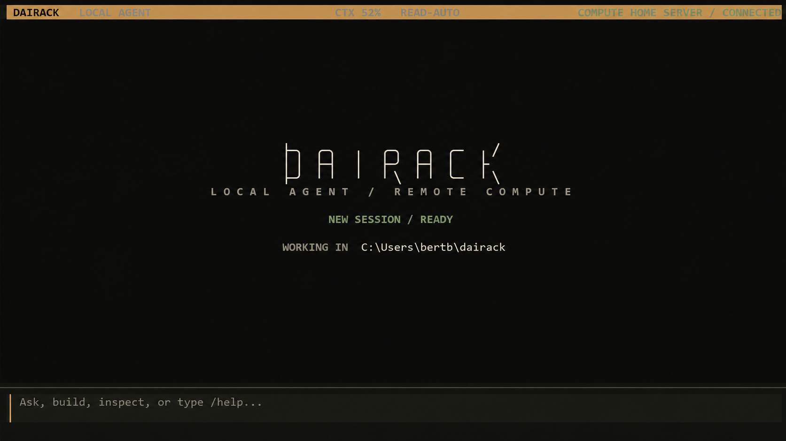
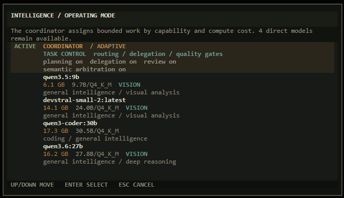

<h1 align="center">DAIRACK</h1>

<p align="center"><strong>LOCAL INTELLIGENCE</strong></p>

<p align="center">
  <a href="https://github.com/rm199x/dairack/actions/workflows/ci.yml"></a>
  <a href="https://www.python.org/downloads/"></a>
  <a href="LICENSE"></a>
</p>

<p align="center">
  <a href="#quick-start">Quick Start</a> &nbsp;&middot;&nbsp;
  <a href="#remote-compute">Remote Compute</a> &nbsp;&middot;&nbsp;
  <a href="#coordinator">Coordinator</a> &nbsp;&middot;&nbsp;
  <a href="#permissions">Permissions</a>
</p>

Dairack is a local-first terminal agent for Ollama. The interface and agent runtime stay on the client; inference can
run locally or through a trusted Dairack server.

<p align="center">
  
</p>

- Keep files, chats, approvals, project indexes, and checkpoints on your machine.
- Review shell commands, file access, network requests, and patches before they run.
- Resume chats and bring project, web, and image context into one workflow.
- Use one model directly or let Coordinator choose among installed models.

> **Status:** Alpha. Dairack is functional and locally verified on Linux. CI covers Linux, Windows, and macOS. Public
> configuration and extension APIs may change before 1.0.

## Quick Start

Dairack requires Python 3.11 or newer, [Ollama](https://ollama.com/) locally or on a Dairack compute server, and at least
one chat model. Git or `patch` is needed for agent-applied edits; `rg` is optional but makes project search faster.

Install from GitHub with an isolated Python tool manager:

```bash
uv tool install git+https://github.com/rm199x/dairack.git
# or
pipx install git+https://github.com/rm199x/dairack.git
```

Then run:

```bash
dairack setup
dairack doctor
dairack
```

<details>
<summary>Install from a cloned checkout</summary>

```bash
git clone https://github.com/rm199x/dairack.git
cd dairack
./scripts/install.sh
dairack setup
dairack
```

On Windows PowerShell:

```powershell
git clone https://github.com/rm199x/dairack.git
Set-Location dairack
.\scripts\install.ps1
dairack setup
dairack
```

The installers choose `uv`, `pipx`, or a private user environment. They do not install packages into the system Python.

</details>

Setup supports NVIDIA, Apple Silicon/Metal, ROCm, Windows hardware probes, and CPU-only systems. See
[Installation](docs/installation.md) for platform notes and non-interactive setup.

## Remote Compute

The same Dairack package runs on the client and the model server. On Linux, install the authenticated bridge as a
restartable user service on the machine with Ollama:

**On the model server**

```bash
dairack serve --install-service --tailscale --name "Home Server"
```

The first Tailscale Serve setup may print a one-time tailnet approval URL. Open it while the command waits; Dairack
continues as soon as Serve is enabled.

Inspect it with `dairack serve --service-status`. Foreground mode remains available by omitting `--install-service`;
that process stops when its terminal closes.

Then connect from the computer where you want to work:

**On the client**

```bash
dairack connect https://server-name.tailnet-name.ts.net
dairack
```

The server prints a pairing token, which the client stores separately with private permissions. The interface, project
files, shell, approvals, chats, indexes, and checkpoints remain on the client. Prompts, selected context, approved tool
results, and attached images are sent to the inference endpoint because the model needs them to answer.

The bridge accepts only the model operations Dairack needs plus read-only hardware information. Return to local Ollama
with `dairack connect local`, or restore the saved server with `dairack connect remote`. Do not expose an unauthenticated
Ollama endpoint to the public internet.

## Models

Any Ollama chat model can be selected directly. Setup inspects the active compute machine, discovers installed models,
and chooses practical runtime defaults. Adding a model does not require a Dairack source change.

```bash
dairack models recommend
dairack models pull <model>
dairack models update <model>
dairack models remove <model>
dairack models
```

<kbd>F6</kbd> or `/library` opens the same searchable model lifecycle in the terminal interface, including transfer
progress, cancellation, profile inspection, and confirmed removal. See
[Models and Coordinator](docs/models.md) for profile tuning and advanced routing controls.

## Coordinator

| Mode | Behavior |
| --- | --- |
| **Adaptive** | Balances response quality, latency, and model-loading cost for each request. |
| **Quality** | Allows more planning, review, and specialist work when it can improve the result. |
| **Efficient** | Favors quick, resident models and simpler execution. |
| **Direct model** | Sends every request to the model you select. |

<p align="center">
  
</p>

One model is enough. With several installed, Coordinator can choose a suitable model for conversation, code, reasoning,
research, or images and fall back when a preferred model is unavailable. Its active model and any planning or review
stage remain visible while work is running. Use `/coordinator` to inspect or change the policy.

Requests such as "use a deeper model" or "keep this lightweight" apply only to that turn. They do not silently change
your saved configuration.

## Terminal Workflow

- <kbd>Ctrl</kbd>+<kbd>P</kbd> opens the command palette; `/help` shows the primary command set.
- <kbd>F3</kbd> opens saved chats or starts a new session. `dairack --resume` restores the latest chat explicitly.
- <kbd>F4</kbd> or `/image` stages up to four supported images for a vision-capable model.
- Agent actions show their target, permission, result, exit status, and elapsed time.
- Code edits show additions and removals, run a dry check, and create a checkpoint before application.
- <kbd>Esc</kbd> closes dialogs. <kbd>Esc</kbd> or <kbd>Ctrl</kbd>+<kbd>C</kbd> interrupts work when the active operation
  supports cancellation. Prompts typed while a response is running queue and send when it completes; an approval holds
  that queue until the action is allowed or denied.

Context handling follows the active model's generated or overridden runtime profile. Dairack reserves answer and
protocol headroom, compacts covered history into grounded memory before the request becomes unsafe, and retains a
small evidence ledger when an active tool workflow outgrows its raw transcript. Large files are read through bounded,
continuable line windows; each completed result is fitted again before the model continues, so smaller contexts retain
the active task and a precise next range instead of stalling after compaction. `/context` shows the current macro
memory, live working set, tool interface, reserves, and estimated next request.

The interface adapts to compact terminals and uses short event-driven transitions, with no animation timer retained
while idle. Set `DAIRACK_REDUCED_MOTION=1` when all non-essential movement should remain disabled.

## Permissions

Agent mode lets a model request tools; it does not grant permission by itself.

| Mode | Behavior |
| --- | --- |
| `ask` | Show every model-requested action for approval. This is the default. |
| `read-auto` | Allow project reads and safe status checks; ask for writes, shell, external paths, and network access. |
| `deny` | Block model-requested tools while keeping direct user commands available. |

Shell commands run with your operating-system privileges after approval. Web searches and page reads leave the machine
and therefore require approval when requested by a model. Dairack's permission layer is an approval boundary, not an
operating-system sandbox. Read [Permissions](docs/permissions.md) and [Security](SECURITY.md) before unattended use.

## Updates

Source installs do not assume a release channel. Once one is configured, `/update` shows the available version, release
notes, and exact local install command before anything runs. See [Release Channel](docs/installation.md#release-channel).

## Local State

Dairack follows standard platform directories:

| Purpose | Linux/macOS default |
| --- | --- |
| Configuration and model registry | `~/.config/dairack/` |
| Chats, checkpoints, and project index | `~/.local/share/dairack/` |
| Cache | `~/.cache/dairack/` |
| Runtime state | `~/.local/state/dairack/` |

Windows uses `%APPDATA%\Dairack` for configuration and `%LOCALAPPDATA%\Dairack` for data, cache, and state. Set
`DAIRACK_HOME=/path` for a fully isolated state tree. Compute credentials are stored separately from configuration and
chat history.

## Development

```bash
python3 -m venv .venv
. .venv/bin/activate
python -m pip install -e '.[dev]'
python -m ruff check src tests tools
python -m pytest
python -m build
```

Use the [documentation index](docs/README.md) for installation, model, permission, architecture, security, contribution,
and release references.
