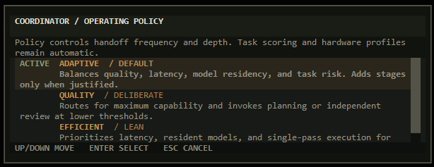

# Models and Coordinator

<p align="center">
  <a href="../README.md">Overview</a> &nbsp;&middot;&nbsp;
  <a href="README.md">Documentation</a> &nbsp;&middot;&nbsp;
  <a href="installation.md">Installation</a> &nbsp;&middot;&nbsp;
  <a href="permissions.md">Permissions</a>
</p>

Dairack can use one Ollama chat model directly or coordinate several models as a capability pool. Model discovery,
profiles, routing, and overrides are provider-neutral; adding a model does not require a source change.

## Model Support

Every installed chat model is available in direct mode. Dairack builds Coordinator profiles from Ollama metadata,
declared capabilities, context limits, parameter scale, compute fit, and optional catalog or user evidence.

| Label | Source | Meaning |
| --- | --- | --- |
| `CURATED` | Versioned Dairack catalog | Known family with reviewed routing estimates |
| `INFERRED` | Provider metadata | Unknown family with transparent, lower-confidence estimates |
| `CALIBRATED` | User or local evaluation | Explicit evidence saved in the local registry |

Tool and vision support are hard capability gates. Quality scores estimate relative fit; they do not manufacture a
capability or guarantee output quality.

## Model Lifecycle

```bash
dairack models recommend [--profile minimal|balanced|complete]
dairack models pull MODEL
dairack models update MODEL
dairack models update --all --yes
dairack models remove MODEL
dairack models refresh
```

`pull` and `update` use Ollama's HTTP API. Re-pulling a mutable tag checks its manifest and reuses unchanged layers.
Versioned tags coexist until removed; removal requires confirmation unless `--yes` is supplied.

In the terminal interface, <kbd>F6</kbd> or `/library` opens the same lifecycle with transfer progress, cancellation,
profile inspection, and confirmed removal. `/models` remains a compatibility alias.

## Coordinator

| Policy | Selection bias |
| --- | --- |
| **Adaptive** | Balances task fit, quality, latency, model residency, and loading cost |
| **Quality** | Permits more planning, review, and specialist work when it can materially help |
| **Efficient** | Favors capable resident or smaller models and avoids unnecessary extra passes |
| **Direct model** | Bypasses routing and uses the selected model for every compatible request |

<p align="center">
  
</p>

Coordinator derives task signals for conversation, coding, agent work, reasoning, research, images, risk, and
complexity. It normally selects one executor. Planning, independent review, or specialist consultation are bounded
stages used only when policy and task evidence support the extra work.

Selection follows four fixed boundaries:

1. The executor must support the input modality and required transport features.
2. Missing preferred roles fall back to the best suitable installed model.
3. Semantic assessment can refine a task signal but cannot grant tools, invent an image, or bypass policy limits.
4. Local outcome learning is evidence-gated and capped. A shared model/role estimate backs off toward a task-kind
   estimate only as that kind accumulates evidence; learning adjusts ranking rather than replacing capability profiles.

There is no required coordinator model. When semantic assessment is useful, Dairack selects an efficient suitable model
from the active registry and requests a schema-validated result.

### Turn-Level Direction

Requests such as "use a larger model," "go deeper," or "keep this light" can adjust one turn when intent is clear and
a suitable model exists. They never persist as a model preference. Discussion about model sizes, or adjectives that
describe the requested content rather than the compute plan, remain on the ordinary automatic route.

## Configuration

Use `/coordinator` in the interface or the command line to inspect and change policy:

```bash
dairack coordinator show
dairack coordinator enable
dairack coordinator disable
dairack coordinator policy adaptive|quality|efficient
```

<details>
<summary>Planning, review, delegation, learning, and role preferences</summary>

```bash
dairack coordinator set planning|review|delegation|semantic|learning on|off
dairack coordinator prefer general|coding|agent|reasoning|research|vision|planner|reviewer MODEL
dairack coordinator prefer ROLE auto
```

Role preferences are soft score bonuses. They never bypass capability checks and automatically fall back when the
preferred model is unavailable or unsuitable.

</details>

<details>
<summary>Capability and runtime overrides</summary>

```bash
dairack models set MODEL coding 0.90
dairack models set MODEL reasoning 0.84
dairack models set MODEL num_ctx 8192
dairack models set MODEL num_batch 192
dairack models reset MODEL
```

Overrides are stored in the local model registry and survive provider refreshes. Use measured local evidence for
capability scores and keep context or batch settings within the active compute machine's practical memory budget.

</details>
